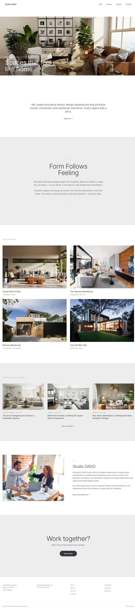

# Prompt Engineer / 提示词工程师 Skill

**English** | [中文](#中文介绍)

> Transform URLs, screenshots, and ideas into production-ready AI development prompts. Supports English, Chinese, and Bilingual output.
>
> 将网址、截图和想法转化为可直接用于 AI 开发的生产级提示词。支持英文、中文和双语输出。

**Compatible with:** Claude Code | OpenClaw | AutoClaw | Any tool using `.claude/skills/` directory

**适用工具：** Claude Code | OpenClaw | AutoClaw | 任何使用 `.claude/skills/` 目录的 AI 编程助手

---

## English

### What is Prompt Engineer?

Prompt Engineer is a **Claude Code skill** that bridges the gap between "I have an idea" and "AI, build this for me."

It works with any AI coding assistant that supports the `.claude/skills/` directory format, including:
- **Claude Code** (official Anthropic CLI)
- **OpenClaw** (open-source Claude Code alternative)
- **AutoClaw** (automated Claude Code workflows)
- Any custom tool using the standard skill discovery mechanism

Instead of spending hours crafting detailed prompts, simply:
- Paste a website URL
- Upload a screenshot
- Describe your project in plain language

...and get back a **pixel-perfect, implementation-ready prompt** you can feed directly to Claude, GPT-4, Cursor, or any AI coding agent.

### How Skills Work

Skills are modular knowledge packs that Claude Code auto-discovers from your `~/.claude/skills/` directory. When you ask something that matches the skill's trigger phrases, it automatically loads specialized workflows, templates, and examples to handle your request better than generic conversation.

### Supported Scenarios

| Scenario | Input Example | Output |
|----------|--------------|--------|
| **Website Clone** | "Clone https://linear.app" | Exact hex colors, typography, animations, responsive breakpoints |
| **Full-Stack App** | "Build a SaaS dashboard" | Database schema, API spec, auth flow, component library |
| **3D/Interactive** | "3D sneaker configurator" | Three.js scene setup, lighting, camera, interaction mapping |
| **Mobile App** | "React Native fitness app" | Screens, navigation, native features, backend integration |
| **Data Visualization** | "Real-time analytics dashboard" | Chart types, WebSocket pipeline, widget specs |
| **Landing Page** | "High-converting marketing site" | Conversion elements, SEO, scroll reveals, A/B hooks |

### Quick Start

#### 1. Install

```bash
# macOS / Linux
git clone https://github.com/mukiiiina/prompt-engineer.git ~/.claude/skills/prompt-engineer

# Windows
git clone https://github.com/mukiiiina/prompt-engineer.git %USERPROFILE%\.claude\skills\prompt-engineer
```

Claude Code auto-discovers skills on launch.

#### 2. Use It

Just ask naturally. The skill triggers automatically.

**Example 1: Website Clone**
```
User: 帮我写个 prompt 复刻这个网站 https://www.midlife.engineering/
AI: [Analyzes URL... extracts colors, fonts, layout, animations]
AI: 你想要中文版还是英文版的 prompt？
User: 中文版
AI: [Generates 2000+ word Chinese prompt with exact hex values, timing, stack]
```

**Example 2: Full-Stack App**
```
User: Generate a prompt for a real-time analytics dashboard
AI: [Identifies scenario: Data Visualization + Full-Stack]
AI: What language do you want the prompt in? English / Chinese / Both?
User: English
AI: [Generates complete prompt with DB schema, API endpoints, widget specs]
```

**Example 3: From Screenshot**
```
User: [Uploads screenshot of a mobile app UI]
User: 帮我写个 prompt 做这样的 App
AI: [Vision analysis identifies layout, colors, components]
AI: 你要中文还是英文 prompt？
User: 双语
AI: [Generates side-by-side English/Chinese prompt]
```

### Language Selection

Before generating, the skill explicitly asks for your preferred output language:

- **English** (Default) — Best for Claude, GPT-4, Cursor, and most AI coding agents
- **Chinese (中文)** — For Chinese-speaking AI agents or when you prefer native language prompts
- **Bilingual (双语)** — Generates both English and Chinese versions side by side

### Live Demo: Website Clone

**Input:** `https://www.studiodado.com/` (editorial minimalist interior design portfolio)

**Analysis Results:**
- Colors: #FFFFFF (bg), #EEEEEE (sections), #313131 (text), #999999 (muted), #32373C (accent)
- Typography: Inter (display/body), weight 400, letter-spacing -0.02em, generous line-height
- Aesthetic: Editorial minimalism, gallery-white, photo-first, "Form Follows Feeling"
- Layout: Fixed nav (80px), full-bleed hero, centered philosophy, 2-column project grid, journal cards

**Generated Prompt Preview:**

```markdown
You are a full-stack development engineer specializing in editorial minimalist aesthetics...

## 1. Core Visual Style
### 1.1 Color System
- Background base: #FFFFFF (pure white, letting photography breathe)
- Secondary background: #EEEEEE (very light gray, subtle section separation)
- Text primary: #313131 (warm dark gray, NOT pure black)
- Text secondary: #666666 (medium gray)
- Text muted: #999999 (light gray, labels)
- Accent: #32373C (dark charcoal, buttons and CTAs)
- Style: Editorial minimalism, gallery-white, photo-first. NO bright colors, NO gradients.

### 1.2 Typography
- Display/Hero: Inter 400, clamp(2.5rem, 5vw, 4rem), letter-spacing -0.02em
- Body large: Inter 400, 1.125rem, line-height 1.7
- Caption/Meta: Inter 400, 0.875rem, color #999999
- Buttons: Pill-shaped, border-radius 9999px

### 1.3 Animations
- Image reveals: Fade in + translateY(20px to 0), 800ms, cubic-bezier(0.25, 0.1, 0.25, 1)
- Project card hover: scale(1.03), 400ms ease
- Scroll reveals: IntersectionObserver, staggered fade-in

### 1.4 Tech Stack
- Next.js 14 + TypeScript + Tailwind CSS
- Framer Motion (scroll reveals) + CSS transitions (hover states)
- Inter font
- Deploy: Vercel
```

[Full prompt → `examples/studiodado-clone.md`](examples/studiodado-clone.md)

**Result Website (generated from the prompt above):**


*Desktop view — 1280px*

### Prompt Quality Standards

Every generated prompt guarantees:

| Standard | Example |
|----------|---------|
| Exact values | `color: #FF6633` not "orange accent" |
| Anti-patterns | `NO gradients`, `NO neon colors` |
| Numeric timing | `transition: 300ms cubic-bezier(0.4, 0, 0.2, 1)` |
| State flows | Hover → Active → Focus → Disabled |
| Responsive specs | Breakpoints at 640/768/1024/1280px |
| Performance | 60fps target, bundle <200KB |

### Example Gallery

| Example | Scenario | File |
|---------|----------|------|
| Midlife Engineering | Website Clone (Industrial Minimalist) | [`examples/midlife-engineering.md`](examples/midlife-engineering.md) |
| Studio DADO Clone | Website Clone (Editorial Minimalist) | [`examples/studiodado-clone.md`](examples/studiodado-clone.md) |
| SaaS Dashboard | Full-Stack App (Analytics) | [`examples/saas-dashboard.md`](examples/saas-dashboard.md) |
| 3D Sneaker Configurator | 3D Interactive (Product Showcase) | [`examples/3d-product-showcase.md`](examples/3d-product-showcase.md) |
| Fitness Tracker App | Mobile App (React Native) | [`examples/mobile-fitness-app.md`](examples/mobile-fitness-app.md) |
| Marketing Landing Page | Landing Page (Conversion) | [`examples/marketing-landing-page.md`](examples/marketing-landing-page.md) |

---

## 中文介绍

### Prompt Engineer 是什么？

Prompt Engineer 是一个 **Claude Code 技能（Skill）**，它帮你把"我有一个想法"变成"AI，帮我做出来"。

不再需要花几小时写详细的提示词，只需要：
- 粘贴一个网站链接
- 上传一张截图
- 用自然语言描述你的项目

...就能获得一个**像素级精确、可直接执行**的专业开发提示词，直接投喂给 Claude、GPT-4、Cursor 或任何 AI 编程助手。

### 支持的场景

| 场景 | 输入示例 | 输出内容 |
|------|---------|---------|
| **网站复刻** | "复刻 https://linear.app" | 精确 hex 色值、字体、动画、响应式断点 |
| **全栈应用** | "做个 SaaS 数据分析后台" | 数据库模型、API 规范、认证流程、组件库 |
| **3D/交互** | "3D 球鞋定制器" | Three.js 场景、灯光、相机、交互映射 |
| **移动应用** | "React Native 健身 App" | 页面、导航、原生功能、后端对接 |
| **数据可视化** | "实时数据仪表盘" | 图表类型、WebSocket 数据流、组件规格 |
| **落地页** | "高转化营销网站" | 转化元素、SEO、滚动动效、A/B 测试钩子 |

### 快速开始

#### 1. 安装

```bash
# macOS / Linux
git clone https://github.com/mukiiiina/prompt-engineer.git ~/.claude/skills/prompt-engineer

# Windows
git clone https://github.com/mukiiiina/prompt-engineer.git %USERPROFILE%\.claude\skills\prompt-engineer
```

Claude Code 启动时会自动发现技能。

#### 2. 使用

自然语言对话即可，技能会自动触发。

**示例 1：网站复刻**
```
用户：帮我写个 prompt 复刻这个网站 https://www.midlife.engineering/
AI：[分析网址...提取色彩、字体、布局、动画]
AI：你想要中文版还是英文版的 prompt？
用户：中文版
AI：[生成 2000+ 字中文提示词，包含精确色值、动画时长、技术栈]
```

**示例 2：全栈应用**
```
用户：Generate a prompt for a real-time analytics dashboard
AI：[识别场景：数据可视化 + 全栈]
AI: What language do you want the prompt in? English / Chinese / Both?
用户：英文
AI：[生成完整提示词，包含数据库模型、API 端点、组件规格]
```

**示例 3：从截图生成**
```
用户：[上传一张 App UI 截图]
用户：帮我写个 prompt 做这样的 App
AI：[视觉分析识别布局、色彩、组件]
AI：你要中文还是英文 prompt？
用户：双语
AI：[生成中英对照的提示词]
```

### 语言选择

生成前，技能会明确询问你想要的输出语言：

- **英文 (English)** — 默认选项，适合 Claude、GPT-4、Cursor 等大多数 AI 编程助手
- **中文 (Chinese)** — 适合中文 AI 助手，或你更习惯用中文描述需求
- **双语 (Bilingual)** — 同时生成英文和中文版本，左右对照

### 实战演示：网站复刻

**输入：** `https://www.studiodado.com/` (编辑极简风室内设计作品集)

**分析结果：**
- 色彩：#FFFFFF（背景）、#EEEEEE（区块）、#313131（文字）、#999999（次要）、#32373C（强调）
- 字体：Inter（标题/正文），字重 400，字间距 -0.02em，宽松行高
- 风格：编辑极简主义、画廊白底、照片优先、"Form Follows Feeling"
- 布局：固定导航（80px）、全出血首屏、居中理念区、2 列项目网格、期刊卡片

**生成的 Prompt 预览：**

```markdown
你是一位专注于编辑极简美学的前端工程师...

## 一、核心视觉风格
### 1. 色彩系统
- 背景主色：#FFFFFF（纯白，让摄影呼吸）
- 次要背景：#EEEEEE（极浅灰，区块分隔）
- 文字主色：#313131（暖深灰，不是纯黑）
- 文字次要：#666666（中灰）
- 文字辅助：#999999（浅灰，标签）
- 强调色：#32373C（深炭灰，按钮）
- 风格：编辑极简、画廊白底、照片优先。禁止亮色、禁止渐变。

### 1.2 排版体系
- 首屏标题：Inter 400, clamp(2.5rem, 5vw, 4rem), 字间距 -0.02em
- 大正文：Inter 400, 1.125rem, 行高 1.7
- 说明文字：Inter 400, 0.875rem, 颜色 #999999
- 按钮：胶囊形，border-radius 9999px

### 1.3 动效
- 图片显现：淡入 + translateY(20px to 0)，800ms, cubic-bezier(0.25, 0.1, 0.25, 1)
- 项目卡片悬停：scale(1.03)，400ms ease
- 滚动显现：IntersectionObserver，错峰淡入

### 1.4 技术栈
- Next.js 14 + TypeScript + Tailwind CSS
- Framer Motion（滚动显现）+ CSS 过渡（悬停状态）
- Inter 字体
- 部署：Vercel
```

[完整提示词 → `examples/studiodado-clone.md`](examples/studiodado-clone.md)

**生成的网站效果（基于上方提示词生成）：**


*桌面端视图 — 1280px*

### Prompt 质量标准

每个生成的提示词都保证：

| 标准 | 示例 |
|------|------|
| 精确数值 | `color: #FF6633` 而不是 "橙色强调" |
| 反模式声明 | `禁止渐变`、`禁止霓虹色` |
| 数值化时间 | `transition: 300ms cubic-bezier(0.4, 0, 0.2, 1)` |
| 完整状态流 | 悬停 → 激活 → 聚焦 → 禁用 |
| 响应式规格 | 断点 640/768/1024/1280px |
| 性能指标 | 60fps 目标，打包 <200KB |

### 示例库

| 示例 | 场景 | 文件 |
|------|------|------|
| Midlife Engineering | 网站复刻（工业极简风） | [`examples/midlife-engineering.md`](examples/midlife-engineering.md) |
| Studio DADO Clone | 网站复刻（编辑极简风） | [`examples/studiodado-clone.md`](examples/studiodado-clone.md) |
| SaaS 仪表盘 | 全栈应用（数据分析） | [`examples/saas-dashboard.md`](examples/saas-dashboard.md) |
| 3D 球鞋定制器 | 3D 交互（产品展示） | [`examples/3d-product-showcase.md`](examples/3d-product-showcase.md) |
| 健身追踪 App | 移动应用（React Native） | [`examples/mobile-fitness-app.md`](examples/mobile-fitness-app.md) |
| 营销落地页 | 落地页（高转化） | [`examples/marketing-landing-page.md`](examples/marketing-landing-page.md) |

---

## Skill Structure

```
prompt-engineer/
├── SKILL.md                              # 核心技能（触发器 + 工作流程 + 语言选择）
├── README.md                             # 本文件（双语文档 + 使用演示）
├── LICENSE                               # MIT 开源协议
├── references/
│   ├── web-clone-patterns.md             # 网站复刻分析框架
│   ├── prompt-templates.md               # 6 种场景 Prompt 模板（A-F）
│   └── tech-stack-guide.md               # 技术栈选择指南
└── examples/
    ├── midlife-engineering.md            # 网站复刻：工业极简音乐设备
    ├── studiodado-clone.md               # 网站复刻：编辑极简室内设计
    ├── saas-dashboard.md                 # 全栈应用：数据分析仪表盘
    ├── 3d-product-showcase.md            # 3D 交互：球鞋定制器
    ├── mobile-fitness-app.md             # 移动应用：健身追踪 App
    └── marketing-landing-page.md         # 落地页：高转化营销网站
```

## How It Works / 工作原理

```
Your Input (URL / Screenshot / Text Description)
           |
           v
   +-----------------------+
   | 1. Scenario Detection |  <- Identify project type
   +-----------------------+
           |
           v
   +-----------------------+
   | 2. Information Extract|  <- Colors, fonts, layout, animations
   +-----------------------+
           |
           v
   +-----------------------+
   | 3. Language Selection |  <- English / Chinese / Bilingual
   +-----------------------+
           |
           v
   +-----------------------+
   | 4. Analysis & Structure| <- Apply templates & frameworks
   +-----------------------+
           |
           v
   +-----------------------+
   | 5. Prompt Generation  |  <- Build structured prompt
   +-----------------------+
           |
           v
   +-----------------------+
   | 6. Validate & Enhance |  <- Quality checks
   +-----------------------+
           |
           v
   Production-Ready Prompt (copy & paste to AI coder)
```

## Contributing / 贡献

**English:** Found a scenario not covered? Want to improve a template? Fork this repo, add your example to `examples/`, and submit a PR.

**中文:** 发现有未覆盖的场景？想改进模板？Fork 本仓库，在 `examples/` 中添加你的示例，然后提交 PR。

## License / 许可证

MIT License — see [LICENSE](LICENSE) for details.

---

**Made with passion for AI-assisted development.**

> "Give me a URL, I'll give you a prompt."
> "给我一个链接，我给你一个提示词。"
